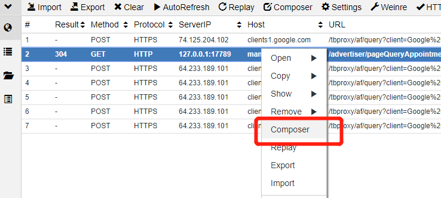
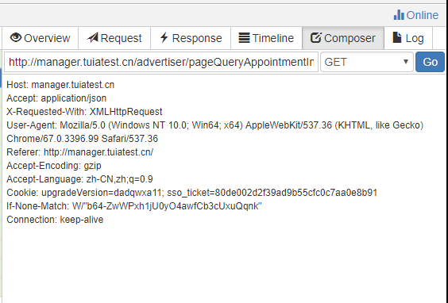

> whistle是基于Node实现的开源跨平台web调试代理工具（其实就是node版的charles \ fiddler）
#### 快捷链接
[中文文档](http://wproxy.org/whistle/)
[Github](https://github.com/avwo/whistle)

## 简介

  whistle与同类代理工具相比拥有以下优势
  - 更友好、简介的图形界面，配置简单
  - 支持正则、通配符，语法简明
  - 中文文档
  - 开源
  - 安装根证书后支持Https
  - 跨平台

## 安装

  安装启动whistle，需要以下四个步骤： 安装Node（推荐v6+）、安装whistle、启动whistle、配置代理。
  ```
  // 下面步骤以win为例，mac用户自行补全命令
  // eg:
  npm install // win
  $ npm install // mac root用户
  sudo npm install // mac 非root用户
  ```

  另：npm默认镜像是在国外，有时候安装速度很慢或者出现安装不了的情况可以开启代理，如果无法安装或者安装很慢，可以使用taobao的镜像安装：
  ```
  // 换源（推荐）
  npm config set registry https://registry.npm.taobao.org

  // 或者直接指定镜像安装：
  npm install whistle -g --registry=https://registry.npm.taobao.org
  ```

  具体安装过程参考中文文档：[安装启动](http://wproxy.org/whistle/install.html)

  推荐使用chrome插件（[SwitchyOmega](https://chrome.google.com/webstore/detail/padekgcemlokbadohgkifijomclgjgif) -- chrome商店，需要科学上网）进行浏览器代理，对其他进程没有影响，并且可以再开另外一个浏览器同时进行其他操作

## 使用
whistle的所有操作都可以通过类似如下配置方式实现：
```
pattern operatorURI
// eg:
http://www.baidu.com  file://C:/test/test.html   //请求百度时返回本地test.html
```

下面对常用功能进行介绍，# 是注释

全部demo
```
# 请求指向本地文件
# http://manager.tuiatest.cn/qualification/pageQueryAccountQualifications file://C:\duiba\fiddler\test.json
# http://www.tuiatest.cn/account/getAccountInfo file://C:\duiba\fiddler\temp.json
# http://yun.tuia.cn/tuia/tuia-advert-manager-node/dist/2d197a212f957aeea478.aptitude.js file://C:\duiba\fiddler\aptitude.js

# manager.tuiatest.cn/qualification/pageQueryAccountQualifications 172.16.80.21

# 请求转发
# http://manager.tuiatest.cn/ 172.16.80.21

# 使用通配符
# ^manager.tuiatest.cn/**/**  172.16.80.21/$1/$2
# http://manager-pre.tuiatest.cn/ 118.31.40.85
# ^manager.tuiatest.cn/********** 172.16.80.21

# host 
# http://manager.tuiatest.cn/ 127.0.0.1:17789
# http://manager.tuiatest.cn/ 172.16.80.21

# 使用正则
# ^http://manager.tuiatest.cn/$ 127.0.0.1:17789/
# ^http://manager-pre.tuia.cn/$ 127.0.0.1:17789/

# 注入
# http://manager.tuiatest.cn/ js://C:\duiba\fiddler\test.js
# http://manager.tuiatest.cn/ css://C:\duiba\fiddler\test.css
# http://manager.tuiatest.cn/ html://C:\duiba\fiddler\test.html

# host
# http://www.tuiatest.cn 127.0.0.1:8080
# http://manager.tuiatest.cn/homePage/queryAdvertData 172.16.80.22


### 页面代理到本地
# ^http://manager.tuiatest.cn/$ 127.0.0.1:17789/

### 接口用测试
# ^manager.tuiatest.cn/********** 172.16.80.21
```

#### 1.测试环境调用本地接口
后端同学平时在改需求的时候需要前端页面方便调试，但是本地起前端项目或者找前端同学帮开还可能有沟通成本。
用postman的话不直观，操作也比较麻烦。
这时可以连测试库，然后用测试机的页面，通过whistle拦截请求，转发到本地，就可以实现用测试环境前端调试了（其他环境同理）

配置如下：
```
### 接口用测试
#### 指向某台服务器
^manager.tuiatest.cn/********** 172.16.80.21
#### 指向本地
^manager.tuiatest.cn/********** 127.0.0.1:17789
```

#### 2.接口直接使用本地mock数据
是否遇到过本地ok，发到线上就有问题的情况呢？调试困难、重现困难，非常头疼。
可以通过whistle直接在线上环境使用本地的js\mock数据进行调试，极大地提高了开发体验。

配置如下：
```
# 请求指向本地文件
http://manager.tuiatest.cn/qualification/pageQueryAccountQualifications file://C:\duiba\fiddler\test.json
```

#### 3.使用Composer直接构造请求
在进行复杂步骤需求的时候可能遇到这种问题：页面上连续点了好多下，最终达到目标接口，调了一下又要重新操作一次。
这时可以使用Composer功能，像postman一样，直接修改入参，调用接口。




#### 4.注入
拦截页面，直接注入html\js\css，方便对线上进行注入<del>攻击</del>调试

配置如下：
```
# 注入
http://manager.tuiatest.cn/ js://C:\duiba\fiddler\test.js
http://manager.tuiatest.cn/ css://C:\duiba\fiddler\test.css
http://manager.tuiatest.cn/ html://C:\duiba\fiddler\test.html
```

#### 5.修改线上资源方便本地调试
将请求的静态资源直接指向本地文件，方式与接口使用本地mock数据一样，不过文件换成了js\html等等，代理后可以修改本地文件进行调试
```
# 使用本地js
http://yun.tuia.cn/tuia/tuia-advert-manager-node/dist/2d197a212f957aeea478.aptitude.js file://C:\duiba\fiddler\aptitude.js
```